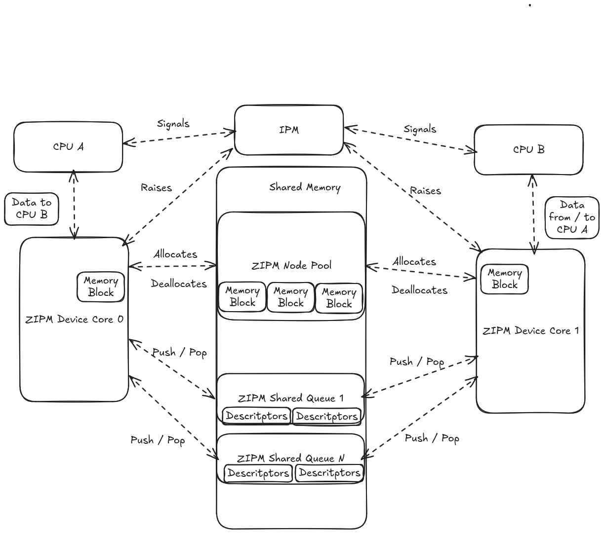

.. _zipm_concepts:

ZIPM The concepts:
##################

ZIPM is an interprocessor messaging subsystem heavily based on the Zephyr
RTOS support, but it is founded on top of some Interprocessor communication
(aka IPC). ZIPM in essence uses the Zephyr kernel infrastrcture to perform
the signaling and syncrhonization between the processors involved in the
communication.

This simplified document tries to explain what is behind the design on 
how the message is passed between the cores.

Shared Queues, the ZIPM backend:
*******************************

Shared memories a significant part to exchange data between two or more CPU
cores, although, for simple primitive values, it is just sufficient to select
a location for both CPU to put, or read, values in that shared RAM, when 
more complex data exchange needs to occur, a more elaborated way to organize
data and its production ordering is also needed.

The ZIPM uses the ZIPM shared queues, which takes some inspiration of a popular
kind of shared ring buffers, the virtqueues. The shared queues of ZIPM are, 
in essence, a ring buffer structure placed in the shared memory, it is split
into two parts, the control structure which has the read and write indexes,
the avail field used to count how much elements are present, followed by
some magic values for validation purposes. The second part is pointer to 
a block of N elements, these elements are called descriptors and they
don't carry any data initially but information on where the actual data is 
stored. When combined it becomes the shared queue, and both sides can exchange
data by filling descriptors and placing onto the shared queues, see below
the data structures implemented:

.. code-block:: c

    __packed struct zipm_shared_queue {
        uint32_t magic_1;
        uint32_t control;
        uint32_t write_idx;
        uint32_t read_idx;
        uint32_t avail;
        uint32_t end;
        uint32_t magic_2;
        struct zipm_node_descriptor *descs;
    };

    __packed struct zipm_node_descriptor {
        uint32_t addr;
        uint32_t size;
        uint32_t flags;
    };

On the ZIPM the information for filling the initial state as well
the location of the descriptors array are extracted from the dts file
you can refer ``dts/bindings`` folder to check the bindings of the shared
queues. The API of the ZIPM shared queues are private and not acessible
directly for the user since the rest of the ZIPM uses it to construct
the messaging system, but in case of interest on having a reference implementation
for porting to other systems, please check ``src/zipm_shared_queue.h`` file.

ZIPM Node Pool, the allocator:
******************************

We discussed the shared queues are responsible to manage and put some
order on the data exchanged between the CPU involved in the IPC. 
The shared queues receives a set of descriptors that does not carry
data, just some information where it is located, so the question is:
"Where is my data?". The ZIPM node pool is responsible to that, when
thinking on how managing data, some considered solutions were the 
usage of the Zephyr kheap and make it shared between the shared
queues users, but taking some inspiration of other messaging system
the RPMSg a solution that fits well was found, a shared memory pool.

In ZIPM is called node pool because the shared memory pool takes a
form of a doubly-intrusive-linked-list, which offers low overhead per-block
and O(1) time complexity to allocate and deallocate, the portion of memories
are called nodes because the form of the linked list aspect the shared pool
has. 

Similar to the shared queue, the ZIPM node pool has also some control fields
and magic values for validation, and right before its control structure, 
referred as nodepool header, there is a chunk of memory split into smaller
pieces of N bytes, which is called the block size, the linked list nodes
are embedded directly on the blocks, and when allocated they are destroyed
yielding on no extra overhead. After the blocks gets deallocated (by being
consumed on the other side) the nodes are reconstructed and the blocks are
re-appended to the list. Refer below its control structure:

.. code-block:: c

    __packed struct zipm_node_pool_header {
        uint32_t magic_1;
        unsigned long control;
        uint32_t blocks_avail;
        uint32_t block_size;
        sys_dlist_t descriptors;
        uint32_t magic_2;
    };

One extra advantage of using a linked list for managing the shared pool is 
the benefit of the blocks not be continguous, once allocated across different
shared queues, they can be deallocated on the same node pool regardless its
position on the actual physical memory.

Similar on the shared queues, the ``dts/bindings`` folder has its bindings,
and although its API is not acessible by the user, it can be referred for 
porting to other systems purpose.

ZIPM Messaging device:
**********************

The third component from ZIPM is the messaging device, here the node pool and
the shared queues forms the foundation of the messaging system. The ZIPM messaging
device takes a form of a Zephyr device driver, allowing users to instantiate and 
uses the same device model of any regular Zephyr application. 

The ZIPM message device is responsible to expose the top level API to the user
and interact with the node pool, shared queues and CPU signaling. When instantiated
the ZIPM message device initializes and sets inside of itself the location of the
node pool, the number and the location of the shared queues, after this setup
is done, it also picks the IPM driver node, and uses that as main signal mechanism.

The signaling mechanism is basically a intercore signal raise everytime there is data
exchanged into one of the shared queues, an event callback can be registered using 
the toplevel api to allow the user to extract the data from the other side in a 
synchronous way.

The message device performs a cycle of operation when data is sent, it checks for
fragmentation, which means if the data transmitted is larger than the block size 
from the node pool it will split the message to fit in multiple blocks, 
the node pool is then used for allocation and copy the blocks of the user
data inside, then a data descriptor is filled with this block information,
and mention its address, the block size and a set of flags to indicate if its
is a single or a fragmented transmission, in that case a chain of fragmented
transmission will create descriptos if FRAG flag set.

After all the descriptors gets pushed to the desired shared queue, the message
device signals the other core using the IPM device instance bounded to it.

The reception cycle is pretty much the inverse, it can be initiated by a reception of
a event callback, which carries the shared queue number in which data exchaging event
ocurred. In that scenario the messaging device will pop the descriptor from the 
selected shared queue and copy the data for the user passed storage, it will
also examine the flags if a FRAG flag is encountered it will return a positive
value to the user which means that transmission still has data to be extracted, at the end
of each call when a copy of the data is succesfull the descriptor output the memory address
which is placed back in the node pool to becomes available for the next usage.

The whole procedure above can be summarized into the simplified diagram below:

The top level API of ZIPM is documented on the ``include/zipm folder``, where the
user will find out how to integrate the ZIPM in their application, also the
``samples`` folder shows a typical usage of the ZIPM sending data in fragmented
and non fragmented way.
