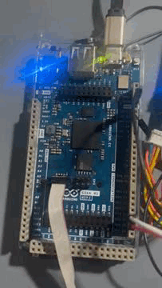

.. _zipm_ping_pong:

ZIPM Ping Pong sample
#####################

This sample is split into two project a tx project that uses shared queue 0 as
a doorbell, that periodically bothers the rx unit. The rx project waits for
an event on event queue 0, and when presents sends a message to the tx
unit which presents into the console

Building and flashing
*********************

Like a regular Zephyr application, for example conside the board
is the Arduino Giga R1, the tx runs on the M7 and rx runs on the
M4, the for the tx:

.. code-block:: console

    $ west build -pauto -barduino_giga_r1/stm32h747xx/m7 zipm/samples/ping-pong/tx
    $ west flash

For the rx, pretty similar:

.. code-block:: console

    $ west build -pauto -barduino_giga_r1/stm32h747xx/m4 zipm/samples/ping-pong/rx
    $ west flash

Expected Output
***************

Connect the console output of the tx side (for Arduino Giga R1) the USB-CDC is used,
so just connect to the host PC, and using your favorite terminal open a session,
you should see something similar on the console:

.. code-block:: console

    *** Booting Zephyr OS build v3.7.0-2699-g9d3539d41bed ***
    [00:00:00.016,000] <inf> usb_cdc_acm: Device suspended
    510: Other core said: Hello from other side!
    [00:00:00.638,000] <inf> usb_cdc_acm: Device configured
    1010: Other core said: Hello from other side!
    1510: Other core said: Hello from other side!
    2010: Other core said: Hello from other side!
    2510: Other core said: Hello from other side!
    3010: Other core said: Hello from other side!
    8011: Other core said: Hello from other side!
    8511: Other core said: Hello from other side!
    9012: Other core said: Hello from other side!
    9512: Other core said: Hello from other side!

You should see also the LED0 (if present) on your board blinking
every time an event arrives to one of the CPUs.

STM32H74xx dual core users, please read!
****************************************

We use for the shared memory the SRAM4 region, and for some reason the Zephyr
kernel does not map this region as a non-cacheable area, which may cause issues
and data loss when using ZIPM, the current workaround I found was to patch
the `mpu_regions.c` files located under `zephyr/soc/st/stm32h7/mpu_regions.c`,

Inside of this file, there is an vector with memory regions, to make sure 
ZIPM will work proper add on the vector the SRAM4 and set the non-cacheable
attribute as shown below:

.. code-block:: c

    MPU_REGION_ENTRY("SRAM4",
                    DT_REG_ADDR(DT_NODELABEL(sram4)),
                    REGION_RAM_NOCACHE_ATTR(REGION_64K)),

It probably there is an way of doing this out-of-tree, that needs
to be investigated later.
